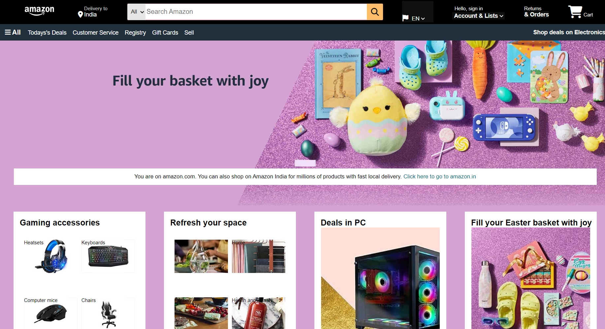
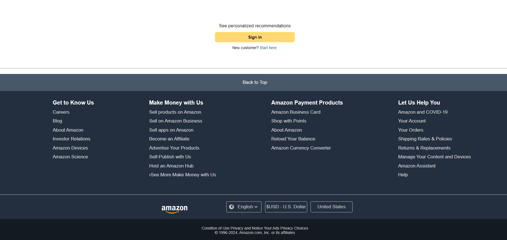

# Amazon-India-clone
This project is a clone of the Amazon website, built using HTML and CSS. Please note that the website is not responsive and is designed for desktop viewing only.

<h2>Features</h2>
 
1.Home Page: A replica of the Amazon home page, featuring product listings and promotional banners.
 
2.Product Listings: Detailed product pages with descriptions, prices, and images.
 
3.Shopping Cart: A basic shopping cart functionality to add and remove items.
 
4.Static Layout: The layout mimics the structure of Amazon's desktop site but does not adapt to different screen sizes.
 
<h2>Technologies Used</h2>
 
HTML: For structuring the content of the web pages.
CSS: For styling the web pages to closely resemble the Amazon website.
 
<h2>Limitation</h2>
Non-Responsive Design: The website is not responsive and is intended for desktop use only.
 
<h2>Screen-shots</h2>

 

 

